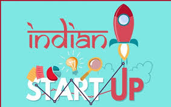

# Data-Visualization-Project-on-Indian-Startup-landscape

This project was part of the course 'Dashboards, Scorecards &amp; Visualizations'. This project was a visual analysis of the startup landscape in India using Tableau.

